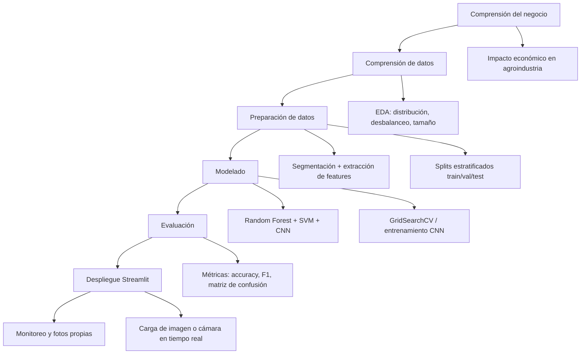

# Metodología CRISP-DM — Clasificación de Calidad de Frutas

## Diagrama de flujo del proyecto

## Fases adaptadas

### 1. Comprensión del negocio
Clasificar manualmente frutas en mercados es lento y subjetivo. Un sistema automático reduce desperdicio y estandariza la calidad comercial.

### 2. Comprensión de datos
Dataset Kaggle (~19k imágenes) + fotos propias del grupo. Análisis de balance entre **Buena/Mala** y variabilidad de tamaño.

### 3. Preparación de datos
- Manifiesto unificado (`data/processed/manifest.csv`)
- Estimación de diámetro en píxeles por contorno
- Split 70/15/15 estratificado

### 4. Modelado
- **ML:** características HOG + histogramas HSV + LBP
- **DL:** CNN simple entrenada desde cero (PyTorch)

### 5. Evaluación
Conjunto de prueba hold-out, validación cruzada en ML, curvas de loss en CNN.

### 6. Despliegue
App Streamlit con carga de archivo y cámara web.

## Consideraciones éticas

- Sesgo hacia tipos de fruta del dataset (manzana, naranja, etc.)
- No reemplaza inspección sanitaria oficial
- Transparencia en limitaciones del modelo
- Datos propios: consentimiento en mercados/fotos en hogar
